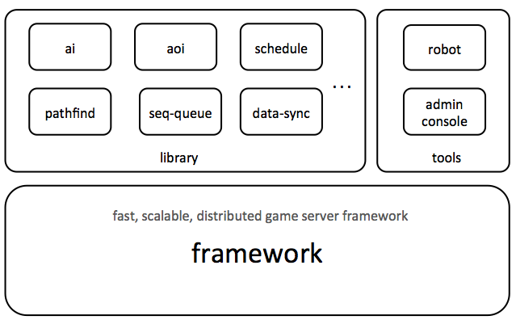

## 介绍

>pomelo是基于node.js的高性能,分布式游戏服务器框架。pomelo不但适用于游戏服务器开发， 也可用于开发高实时web应用，它的分布式架构可以使pomelo比普通的实时web框架扩展性更好。

#### 结构

- 框架, pomelo的核心, 与以往单进程的游戏框架不同, 它是高性能、分布式的游戏服务器框架，并且使用很简单
- 库, 包括了开发游戏的常用工具库， 如人工智能(ai), 寻路， aoi等
- 工具包, 包括管理控制台, 命令行工具, 压力测试工具等

#### 特性

###### 高可伸缩、性能
- 分布式（多进程）架构
- 服务器扩展灵活、方便
- 充分的压力测试和优化

###### 易用
- 极简的API，请求、响应、广播
- 几乎零配置，Convention over configuration
- 基于node.js，轻量，开发快速

###### 强大
- 库和工具包完整、强大
