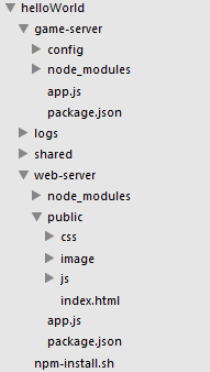

## 安装

>npm install pomelo -g

## 使用

#### 新建项目

- 本地新建目录：
>mkdir helloWorld

- 进入新建目录：
>cd helloWorld

- 初始化项目：
>pomelo init .

- 安装依赖包
>sh npm-install.sh

#### 目录结构

#### 启动项目

>分别启动game-server(游戏服务器)和web-server(web服务器)。
