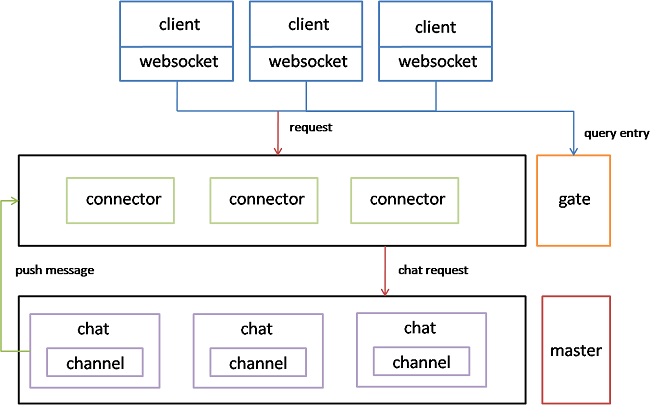

## 架构

#### gate服务器
>作用:做前端的负载均衡。客户端往往首先向gate服务器发出请求，gate会给客户端分配具体的connector服务器。

#### connector服务器
>connector服务器接收客户端的连接请求，创建与客户端的连接，维护客户端的session信息。

#### chart服务器
>完成实际的应用逻辑，向客户端提供服务。

#### master服务器
>master服务器加载配置文件，通过读取配置文件，启动所配置的服务器集群，并对所有服务器进行管理。
